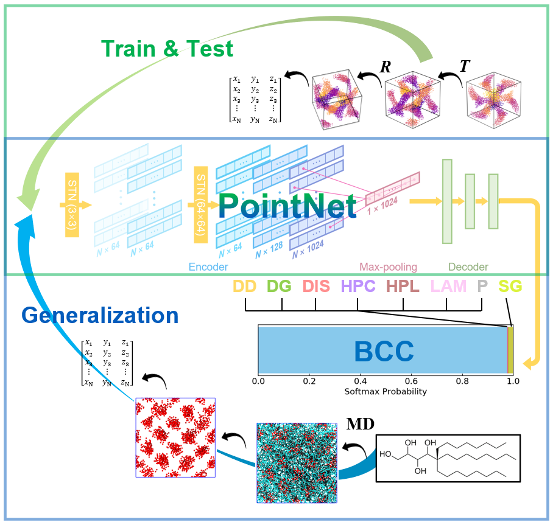
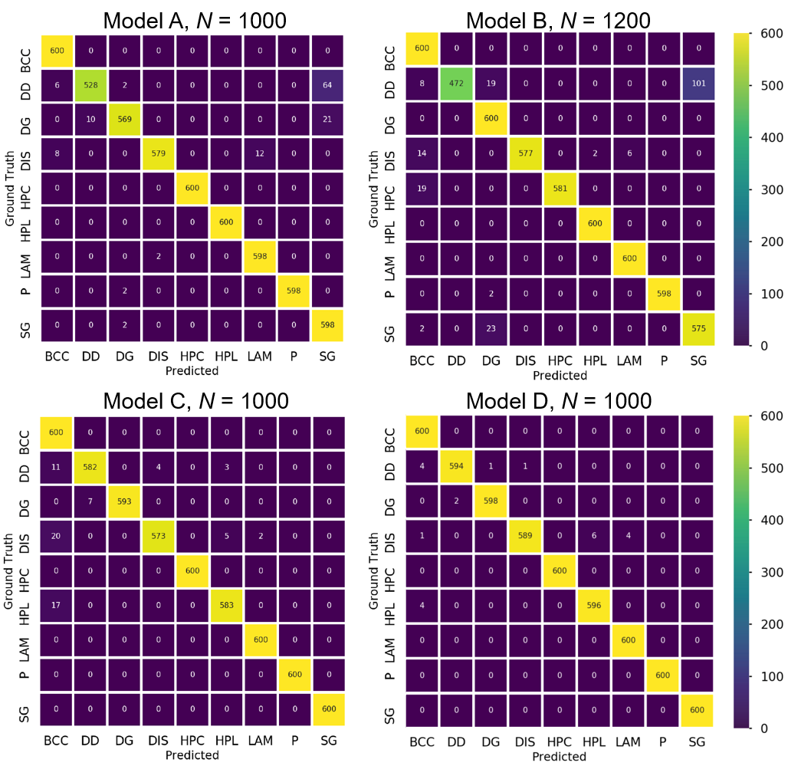

# pointnet.phasedetection


<!-- TABLE OF CONTENTS -->
<details open="open">
  <summary>Table of Contents</summary>
  <ol>
    <li>
      <a href="#about-this-project">About This Project</a>
      <ul>
        <li><a href="#relevant-work">Relevant Work</a></li>
      </ul>
    </li>
    <li>
      <a href="#getting-started">Getting Started</a>
      <ul>
        <li><a href="#prerequisites">Prerequisites</a></li>
        <li><a href="#data-downloads">Data Downloads</a></li>
      </ul>
    </li>
    <li>
      <a href="#usage">Usage</a>
      <ul>
        <li><a href="#data-preprocessing">Data Preprocessing</a></li>
        <li><a href="#training">Training</a></li>
      </ul>
    </li>
    <li>
      <a href="#results">Results</a>
      <ul>
        <li><a href="#test-accuracy">Test Accuracy</a></li>
        <li><a href="#confusion-matrices">Confusion Matrices</a></li>
      </ul>
    </li>    
    <li><a href="#contributing">Contributing</a></li>
    <li><a href="#reference">Reference</a></li>
  </ol>
</details>


<!-- ABOUT THE PROJECT -->
## § About This Project


### Publication Detail

[Development of a PointNet for Detecting Morphologies of Self-Assembled Block Oligomers in Atomistic Simulations](https://doi.org/10.1021/acs.jpcb.1c02389)

This repo uses PointNet [[1](https://arxiv.org/abs/1612.00593)], a neural network designed for computer vision applications using point clouds. In this study, a properly-trained PointNet was demonstrated to be highly generalizable on morphology detection in molecular simulations, and can be potentially extended to discovery of emerging ordered patterns from non-equilibrium systems.

The PointNet was trained on atomic coordinates of mesophases including lamellar (_LAM_), body-centered cubic (_BCC_), hexagonally-packed cylinder (_HPC_), hexagonally-perforeated lamellar (_HPL_), and disorderd (_DIS_) from molecular dynamics (MD) simulation trajectories from our previous work [[2](https://pubs.acs.org/doi/10.1021/jacs.0c01829), [3](https://pubs.acs.org/doi/abs/10.1021/acs.nanolett.9b01248), [4](https://pubs.acs.org/doi/abs/10.1021/acsnano.7b09122)] and synthetic point clouds for ordered network morphologies that were absent from previous simulations, including double diamond (_DD_), double gyroid (_DG_), plumber's nightmare (_P_), and single gyroid (_SG_).


### Relevant Work
The PointNet architecture is taken from [[1](https://arxiv.org/abs/1612.00593)], also see implementation in Tensorflow (https://github.com/charlesq34/pointnet) and in PyTorch (https://github.com/fxia22/pointnet.pytorch). DeFever et. al. [[5](https://doi.org/10.1039/C9SC02097G)] also presented the use of PointNet to identify local structures in coarsed grained MD simulations.


<!-- GETTING STARTED -->
## § Getting Started


### Prerequisites

  ```sh
  pip install -m requirements.txt
  ```

### Data Downloads


1. Download pre-processed `point_clouds` and raw training data `raw` from [here](https://drive.google.com/drive/folders/1N8BjACdNCKTmEnRF46VKkoHufLV8VoMt?usp=sharing). Note: the `raw` folder contains 100 example `.pdb` (~1.1 G) files for each structure. A complete data set contains ~38 G of data and will be available upon request.
2. Put `point_clouds` and `raw` into the `data` folder.


<!-- USAGE EXAMPLES -->
## § Usage

### Data Preprocessing:
  - Generate point clouds (normalized coordinates of minority components) from original `.pdb` files (simulation frames):
     ```sh
     cd ./data
     python process_pdb.py -c LAM -t -r 
     ```
     -c: name of the phases available form `.pdb` files (BCC, DIS, HPC, HPL, or LAM)\
     -t: perform random translations of point clouds wrapped by periodic boundary conditions\
     -r: perform random uniform rotations of point clouds wrapped by periodic boundary conditions
   - Generate point clouds of network structures:
     ```sh
     cd ./data
     python process_net.py -c DG -t -r -n 3000
     ```
     -c: name of the network phases (DD, DG, P, or SG)\
     -t: perform random translations of point clouds wrapped by periodic boundary conditions\
     -r: perform random uniform rotations of point clouds wrapped by periodic boundary conditions\
     -n: total number of point clouds (train + test) to generate 
### Training:
  - Train the PointNet using preprocessed data:
     ```sh
     cd ./utils
     python train_classification.py -b 64 -n 1000 -e 100 -d ../data/point_clouds/ -f 
     ``` 
     -b: size of minibatch\
     -n: number of points selected from each point cloud, so that the input point clouds will have uniform dimension n*3\
     -e: number of training epochs\
     -d: data path\
     -f: implement feature transformation (spatial transformer network, or STN) 


<!-- RESULTS -->
## § Results

The highest accuracy and the corresponding confusion matrices for different models:

### Test Accuracy

| Model | Strategy | Accuracy | CI |
| :---: | :---: | :---: | :---: | 
| A | translation | 0.973 | 0.010 |
| B | translation + STN | 0.957 | 0.011 |
| C | translation + rotation | 0.983 | 0.009 |
| **D** | translation + rotation + STN | **0.990** | 0.005 |

### Confusion Matrices




### Model Downloads
Download model states during training from `trained_models` [https://drive.google.com/drive/folders/1N8BjACdNCKTmEnRF46VKkoHufLV8VoMt?usp=sharing](https://drive.google.com/drive/folders/1N8BjACdNCKTmEnRF46VKkoHufLV8VoMt?usp=sharing). 

<!-- CONTRIBUTING -->
## § Contributing

Contributions are what make the open source community such an amazing place to be learn, inspire, and create. Any contributions you make are **greatly appreciated**.

1. Fork the Project
2. Create your Feature Branch (`git checkout -b feature/AmazingFeature`)
3. Commit your Changes (`git commit -m 'Add some AmazingFeature'`)
4. Push to the Branch (`git push origin feature/AmazingFeature`)
5. Open a Pull Request

Project Link: [https://github.com/donshen/pointnet.phasedetection](https://github.com/donshen/pointnet.phasedetection)

<!-- REFERENCE -->
## § Reference
1. C. R. Qi, H. Su, K. Mo and L. J. Guibas, PointNet: Deep Learning on Point Sets for 3D Classification and Segmentation. _Proceedings of the IEEE Conference on Computer Vision and Pattern Recognition_, **2017**, 652–660. [[link](https://arxiv.org/abs/1612.00593)]
2. Shen, Z. Chen, L. J.; Vernadskaia, V.; Ertem, S. P.; Mahanthappa, M. K.; Hillmyer, M. A. Reineke, T. M.; Lodge, T. P.; Siepmann, J. I.
From Order to Disorder: Computational Design of Triblock Amphiphiles with 1 nm Domains. _J. Am. Chem. Soc_. **2020**, _142_, 9352‐9362. [[link](https://pubs.acs.org/doi/10.1021/jacs.0c01829)]
3. Barreda, L.; Shen, Z.; Chen, Q. P.; Lodge, T. P.; Siepmann, J. I.; Hillmyer, M. A. Synthesis, Simulation, and Self‐Assembly of a Model
Amphiphile to Push the Limits of Block Polymer Nanopatterning. _Nano Lett._ **2019**, _19_, 4458‐4462. [[link](https://pubs.acs.org/doi/abs/10.1021/acs.nanolett.9b01248)]
4. Chen, Q. P.; Barreda, L.; Oquendo, L. E.; Hillmyer, M. A.; Lodge, T. P.; Siepmann, J. I. Computational Design of High-_χ_ Block Oligomers for Accessing 1 Nm Domains. _ACS Nano_ **2018**, _12_, 4351− 4361. [[link](https://pubs.acs.org/doi/abs/10.1021/acsnano.7b09122)]
5. R. S. DeFever, C. Targonski, S. W. Hall, M. C. Smith, and S. Sarupria,
A generalized deep learning approach for local structure identification in
molecular simulations, _Chem. Sci._ **2019**, _10_, 7503–7515. [[link](https://doi.org/10.1039/C9SC02097G)]


<!-- MARKDOWN LINKS & IMAGES -->
[1]: https://arxiv.org/abs/1612.00593
[2]: https://pubs.acs.org/doi/10.1021/jacs.0c01829
[3]: https://pubs.acs.org/doi/abs/10.1021/acs.nanolett.9b01248
[4]: https://pubs.acs.org/doi/abs/10.1021/acsnano.7b09122
[5]: https://doi.org/10.1039/C9SC02097G
[pointnet-schematic]: images/POINTNET_SCHEME_PRE.png

## § Citation
```
@article{shen2021development,
author = {Shen, Zhengyuan and Sun, Yangzesheng and Lodge, Timothy P. and Siepmann, J. Ilja},
title = {Development of a PointNet for detecting morphologies of self-assembled block oligomers in atomistic simulations},
journal = {J. Phys. Chem. B},
volume = {125},
number = {20},
pages = {5275-5284},
year = {2021},
doi = {10.1021/acs.jpcb.1c02389},
URL = {https://doi.org/10.1021/acs.jpcb.1c02389}
}

```
